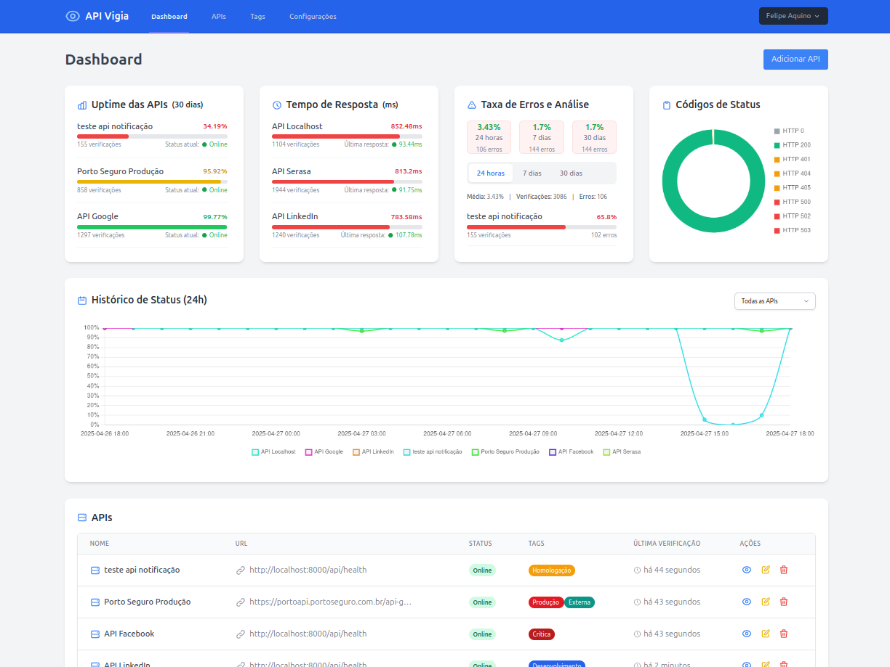
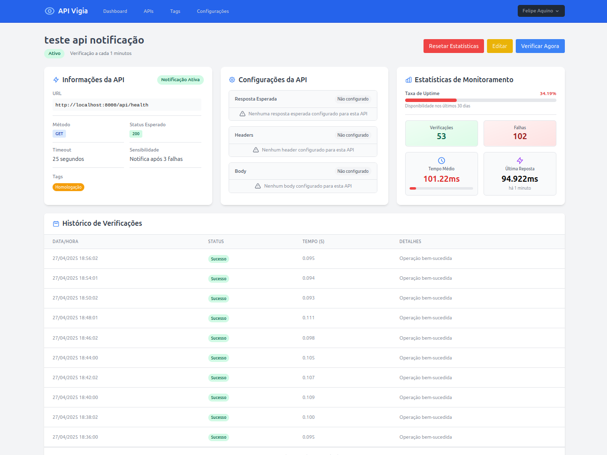

# API Vigia - Monitoramento Inteligente de APIs

**Solução completa para monitoramento de APIs com relatórios detalhados e alertas em tempo real.**

[](https://github.com/feharo-tech/api-vigia)  
[](LICENSE)

---

## 📌 Visão Geral

O **API Vigia** é uma ferramenta open source desenvolvida para monitoramento contínuo de APIs.  
Com ele, você pode verificar a saúde de suas APIs, receber alertas instantâneos sobre falhas e acessar relatórios detalhados de desempenho.

> **Dê uma ⭐ no projeto para nos ajudar a continuar oferecendo soluções gratuitas de qualidade!**

---

## ✨ Funcionalidades Principais

### 🔍 Monitoramento Contínuo

-   Verificações periódicas automáticas (configuráveis por API)
-   Suporte a múltiplos métodos HTTP (GET, POST, PUT, DELETE, etc.)
-   Validação de status code esperado
-   Verificação de conteúdo na resposta

### 📊 Dashboard Intuitivo

-   Visão geral do status de todas as APIs
-   Gráficos de disponibilidade histórica
-   Uptime/downtime por período
-   Tempo médio de resposta

### 🚨 Sistema de Alertas

-   Notificações quando APIs ficam indisponíveis
-   Configuração de frequência de notificação
-   Alertas para degradação de performance

### 📈 Relatórios Detalhados

-   Histórico completo de verificações
-   Métricas de desempenho

### 🔧 Outras Features

-   Sistema de tags para organização
-   Gestão de usuários
-   Resetar estatísticas da API
-   Verificar API na hora

---

## 🛠️ Tecnologias Utilizadas

-   **Backend:** Laravel 11
-   **Frontend:** Livewire, Alpine.js, Tailwind CSS
-   **Banco de Dados:** MySQL/PostgreSQL
-   **Cache e Filas:** Redis (via Predis)
-   **Gráficos:** Chart.js

---

## 🚀 Como Começar

### Pré-requisitos

-   PHP 8.2+
-   Composer
-   Node.js 20+
-   Banco de dados (MySQL ou PostgreSQL)
-   Redis Server instalado e rodando
-   Extensão PHP Redis ou biblioteca Predis

### Instalação

```bash
# Clone o repositório
git clone https://github.com/feharo-tech/api-vigia.git
cd api-vigia

# Instale as dependências PHP
composer install

# Instale as dependências Node.js
npm install
npm run dev

# Configure seu ambiente
cp .env.example .env
php artisan key:generate

# Configure seu banco de dados, os dados do usuário padrão para login e as configurações para envio de email no arquivo .env

# Rode as migrations e seeds
php artisan migrate --seed

# Inicie o servidor
php artisan serve

# Inicie o job
php artisan queue:work

# Inicie o agendamento
php artisan schedule:work
```

Acesse: [http://localhost:8000](http://localhost:8000) e comece a monitorar suas APIs!

---

## 📸 Screenshots

### Dashboard

Dashboard com visão geral das APIs monitoradas:



### Detalhes da API

Visualização detalhada de uma API específica:



---

## 🤝 Como Contribuir

1. Faça um **fork** do projeto.
2. Crie uma **branch** para sua feature:
    ```bash
    git checkout -b feature/NomeDaFeature
    ```
3. Commit suas alterações:
    ```bash
    git commit -m "Adiciona nova funcionalidade: NomeDaFeature"
    ```
4. Push para a branch:
    ```bash
    git push origin feature/NomeDaFeature
    ```
5. Abra um **Pull Request**.

---

## 📄 Licença

Distribuído sob licença **MIT**.  
Consulte o arquivo [LICENSE](LICENSE) para mais informações.

---

## 🌟 Sobre a Feharo Tech

**Criado por [Felipe Aquino](https://github.com/feharo) - [Feharo Tech](https://tech.feharo.com.br) 🚀**

A **Feharo Tech** é uma empresa especializada em soluções tecnológicas inovadoras.  
Oferecemos consultoria, desenvolvimento de software e soluções personalizadas para negócios digitais.

> **Dê uma estrela ⭐ no projeto para nos ajudar a continuar desenvolvendo ferramentas open source de qualidade!**

---

## ✉️ Contato

-   **Email:** tech@feharo.com.br
-   **Site:** [https://www.feharo.com.br](https://www.feharo.com.br)
-   **LinkedIn:** [https://www.linkedin.com/company/feharo-tech](https://www.linkedin.com/company/feharo-tech)
